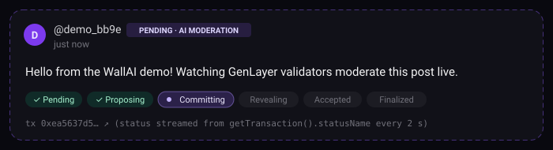

# WallAI

**WallAI** is an AI-moderated social wall built on [GenLayer](https://genlayer.com) and deployed to **GenLayer Studionet**.
Live app: **https://wallai-eta.vercel.app**

Anyone with a wallet can post a short message (up to 280 characters). Before anything is published, an
**intelligent contract** asks an LLM whether the message is appropriate, and GenLayer validators must agree on
that decision through the **Equivalence Principle**. You watch consensus happen live, then your post is
approved or rejected in place. On top of the wall: likes, AI-moderated replies, unique handles, a leaderboard, a
public list of rejections, and a one-time **appeal** to a stricter AI reviewer.


| | |
|---|---|
| Network | GenLayer Studionet (chain ID `61999`, RPC `https://studio.genlayer.com/api`) |
| Contract (v2) | [`0x8F98648c3569875267538236F58cA9056a8Cc596`](https://explorer-studio.genlayer.com/address/0x8F98648c3569875267538236F58cA9056a8Cc596) |
| Deploy tx | [`0xbbff33ee…45e9f7610`](https://explorer-studio.genlayer.com/transactions/0xbbff33ee39ca8ebb72d38ee40d400c28026f50654e4e226caa49aed45e9f7610) |
| Frontend | [wallai-eta.vercel.app](https://wallai-eta.vercel.app) (Next.js on Vercel) |
| Previous (v1) contract | `0x7cD9D77c23024D21868dA19F9FD4cE723aE2241b` (see `deployments/studionet-v1.json`) |

> Studionet is a temporary, hosted development network and its state can be reset. If the contract above no
> longer exists, redeploy it (see [Deploy](#deploy)).

## Features

- **Live consensus status + optimistic posts.** The moment you sign, your message appears on the wall as a
  *pending* card. The card follows the transaction's `statusName` (Pending → Proposing → Committing → Revealing →
  Accepted → Finalized) and then turns into **approved** or **rejected (with the AI's reason)** in place.
- **Public "Rejected" tab.** Every rejection is listed with author, time and the AI's reason. The text itself is
  not returned by any view unless an appeal overturns the decision.
- **Appeals.** The author of a rejected post can appeal it **once**. A second prompt, a *senior appeal reviewer*
  that weighs context, tone, sarcasm, quotes, slang and false positives (keywords alone are not violations), re-moderates it. If overturned, the post is
  published with an **"Approved on appeal"** badge; otherwise the appeal is marked denied with the reviewer's reason.
- **Likes.** One like per wallet per message (toggle). You cannot like your own message.
- **Replies.** Short replies (200 characters), moderated by the same AI moderator and validator consensus.
- **Handles.** Claim a unique `@handle` (3–20 characters, `a-z 0-9 _`) that is shown instead of your address.
- **Leaderboard.** Top posters by approved posts, then likes received, then replies.
- **Open Graph / Twitter card** generated with `next/og` (`frontend/app/opengraph-image.tsx`).



See the Wall, Rejected and Leaderboard tabs live at [wallai-eta.vercel.app](https://wallai-eta.vercel.app)
(deep links: [`/#rejected`](https://wallai-eta.vercel.app/#rejected), [`/#leaderboard`](https://wallai-eta.vercel.app/#leaderboard)).

## How moderation works

1. **Submit**: the user calls `post_message(text)` from MetaMask (Studionet is gasless). Input is checked
   deterministically first: empty messages and messages longer than 280 characters are reverted.
2. **Leader proposes**: inside a non-deterministic block the leader validator sends the message to an LLM with
   `gl.nondet.exec_prompt(prompt, response_format="json")`. The model must answer `{"approved": bool, "reason": str}`.
   The message is wrapped in `<message>` tags and treated as untrusted data, which mitigates prompt injection.
3. **Validators verify**: `gl.vm.run_nondet_unsafe(leader_fn, validator_fn)`. Each validator rejects malformed
   leader output, **re-runs the moderation independently**, and agrees only on the **same approve/reject decision**.
   The free-text reason is not compared, because two LLMs word it differently.
4. **Outcome**: approved posts go on the wall; rejected posts are stored as a `Rejection` (author, time, reason and,
   privately, the text so it can be appealed). If validators cannot agree the transaction ends `UNDETERMINED`.
5. **Appeal**: `appeal(rejected_id)` runs the stricter appeal-reviewer prompt under the same consensus pattern.

The moderator rejects hate speech, harassment and threats, explicit content, spam, scams and phishing, requests
for seed phrases or private keys, other people's personal data, and gibberish. Everything else is approved.

## Contract API (`contracts/wall_ai.py`)

| Method | Type | Description |
|---|---|---|
| `post_message(text)` | write | Moderates a post. Returns `{approved, reason, id}` (`id` = message id or rejection id). |
| `reply(message_id, text)` | write | Moderated reply (≤ 200 chars). Returns `{approved, reason, id}` (`id` = -1 if rejected). |
| `like(message_id)` | write | Toggles your like. Returns `{liked, likes}`. Self-likes revert. |
| `set_handle(handle)` | write | Claims a unique handle (`[a-z0-9_]{3,20}`, a leading `@` is stripped). |
| `appeal(rejected_id)` | write | Author-only, once. Returns `{overturned, reason, message_id}`. |
| `get_messages(offset, limit)` | view | Approved messages, newest first, with `handle`, `likes`, `replies`, `via_appeal`. |
| `get_message(id)` / `get_all_messages()` / `get_message_count()` | view | Single message / all / count. |
| `get_replies(message_id, offset, limit)` | view | Replies, oldest first. |
| `get_rejected(offset, limit)` / `get_rejected_count()` | view | Rejections, newest first: `id, author, handle, timestamp, reason, appeal_status, appeal_reason, appeal_timestamp, message_id, text` (`text` is empty unless overturned). |
| `get_stats()` | view | `{approved, rejected, total, appeals, overturned, replies, rejected_replies, likes, users}` |
| `get_author_stats(author)` | view | `{approved, rejected, replies, likes_received, last_rejection_reason, handle}` |
| `get_handle(author)` / `resolve_handle(handle)` | view | Address ↔ handle lookups. |
| `has_liked(message_id, author)` / `get_liked(author, ids)` | view | Like state for one / many messages. |
| `get_leaderboard(limit)` | view | Up to 50 rows: `address, handle, approved, likes_received, replies, rejected`. |

Storage follows GenVM rules: `DynArray` of `@allow_storage @dataclass` structs (`Message`, `Reply`, `Rejection`),
`TreeMap[str, …]` / `TreeMap[Address, …]` indexes, and `u256` counters.

> **Privacy note.** Rejected text is stored so it can be appealed, and it is never returned by `get_rejected` unless
> the appeal overturns the decision. It is still part of the public transaction calldata on-chain, so it is hidden
> from the app, not secret.

## Project structure

```
contracts/wall_ai.py          Python intelligent contract (GenVM)
tests/direct/                 Fast in-memory tests with a mocked LLM (genlayer-test direct mode)
scripts/create-wallet.mjs     Generates a new wallet into .env (key is never printed)
scripts/deploy.mjs            Deploys the contract to Studionet with the .env wallet
scripts/e2e.mjs               Real end-to-end test on Studionet (posts, rejection, appeal, like, reply, handles, views)
scripts/appeal-probe.mjs      Tries to provoke a false positive and appeal it (exercises the overturn path)
scripts/schema-check.mjs      Asks Studionet to parse the contract and print its schema (read-only)
scripts/lib.mjs               Shared helpers (clients, receipt inspection, readable-payload parser)
deployments/                  Deployment records and e2e results (v1 files kept for history)
frontend/                     Next.js 16 app (genlayer-js + MetaMask, React Query, Tailwind 4)
docs/ci.yml                   CI workflow (genvm-lint, direct tests, frontend build)
docs/                         Live-status illustration (pending.svg)
```

## Setup

Requirements: Node.js 20+, Python 3.12+, Git. Docker is **not** needed for Studionet.

```bash
git clone https://github.com/DikaCream/WallAI.git
cd WallAI
npm install                          # genlayer-js for the scripts
python3 -m venv .venv && source .venv/bin/activate
pip install -r requirements.txt      # genvm-linter, genlayer-test, pytest
```

### Lint and test the contract

```bash
genvm-lint check contracts/wall_ai.py   # GenVM static analysis + SDK validation
pytest tests/direct/ -q                 # 18 direct-mode tests with mocked LLM responses
```

A ready-made GitHub Actions workflow that runs these checks plus the frontend build is in
[`docs/ci.yml`](docs/ci.yml). To enable it, copy it to `.github/workflows/ci.yml` (adding workflow
files needs a GitHub token with the `workflow` scope, or use the GitHub web UI).

## Deploy

```bash
npm run wallet:new          # creates a fresh wallet in .env (gitignored); prints only the address
npm run deploy:studionet    # deploys contracts/wall_ai.py, writes deployments/studionet.json
                            # and frontend/.env.local with NEXT_PUBLIC_CONTRACT_ADDRESS
npm run e2e:studionet       # real e2e run, results in deployments/e2e-studionet.json
```

Studionet is gasless, so a new, unfunded wallet can deploy. If a deploy is interrupted after the hash is printed,
resume with `node scripts/deploy.mjs --tx 0x...`. The GenLayer CLI also works:
`genlayer network set studionet && genlayer deploy --contract contracts/wall_ai.py`.

### Latest end-to-end run (Studionet, v2 contract)

| Step | Result |
|---|---|
| Wallet A `set_handle("demo_bb9e")` | ACCEPTED / SUCCESS |
| Wallet B `set_handle("friend_1a8de8")` | ACCEPTED / SUCCESS |
| Clean post | approved (message #0) |
| Abusive scam post | rejected (rejection #0): scam/phishing crypto offer, suspicious link, insulting language |
| Borderline sports-hyperbole post | approved (message #1) |
| Appeal on the abusive post | denied: "Clear crypto phishing scam… uphold rejection" |
| B likes A's post | `{liked: true, likes: 1}` |
| B replies to A's post | approved (reply #0) |
| Views | rejected view hides text, reply visible, like recorded, leaderboard and handles correct |

Two security-PSA posts mentioning seed phrases were also approved (`scripts/appeal-probe.mjs`), so the moderator
produced no natural false positive to overturn. The overturn path is covered by the direct tests. All transaction
hashes are in `deployments/e2e-studionet.json`.

## Run the frontend

```bash
cd frontend
cp .env.example .env.local      # skip if deploy:studionet already created it
npm install
npm run dev                     # http://localhost:3000
npm run build && npm start      # production build
```

The frontend uses `genlayer-js` with the `studionet` chain: an account-less client for reads and a client with
`provider: window.ethereum` for writes. After signing, `lib/wallai.ts#sendTx` polls `getTransaction` every 2 s and
streams `statusName` to the UI until the transaction is accepted. It keeps watching in the background for
`FINALIZED`. Tabs can be deep-linked: `/#rejected`, `/#leaderboard`.

On Vercel, set the project root to `frontend` and add the `NEXT_PUBLIC_*` variables from `frontend/.env.example`.

## Security notes

- `.env` holds a private key and is gitignored. Never commit it. The key in it is a throwaway test key.
- The frontend never handles private keys; all writes are signed in MetaMask.
- LLM moderation is probabilistic. Validators only agree on the approve/reject decision, so borderline content may
  end up undetermined or be decided differently on a retry.

## License

MIT
